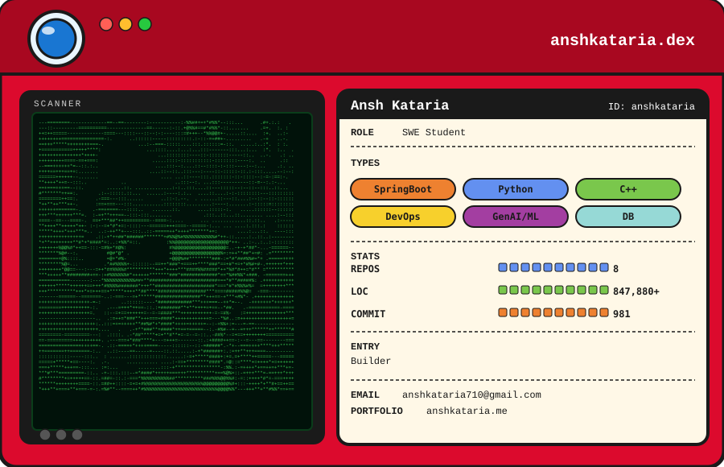

<picture>
  <source media="(prefers-color-scheme: dark)" srcset="dark.svg">
  <source media="(prefers-color-scheme: light)" srcset="dark.svg">
  
</picture>

### Currently

AI & ML Intern @ ChatStat &middot; Honours thesis: *Catching Cyber Criminals &mdash;
A Multi-tier Approach to Attributing Cryptocurrency Crime* &middot; UQ, Class of 2027

### Selected work

**[Pitstop Intelligence](https://github.com/anshkataria/pitstop-intelligence)** &mdash; F1 analytics as five polyglot microservices.
Live timing over SSE with Redis pub/sub fan-out; XGBoost predictions from a
dedicated inference service with MLflow tracking. Internal-token trust boundaries
between services.
`Java 21` `Spring Boot` `FastAPI` `Angular` `Redis` `XGBoost` `Docker`

**[Ticket Tailor](https://github.com/CSSE6400/2026-Prac3-TicketTailor)** &mdash; Serverless event platform, 6-person Agile team. Seven Lambdas
behind API Gateway, Cognito auth, RDS behind a PgBouncer pooler to survive Lambda
connection storms. EventBridge + SQS notification engine.
`AWS Lambda` `API Gateway` `DynamoDB` `SQS` `EventBridge` `React`

**[Veloce](https://github.com/anshkataria/veloce)** &mdash; Commerce monorepo, two React
frontends on one Spring Boot API. Server-authoritative pricing, pessimistic locking
against oversell, signature-verified Stripe webhooks, full test pyramid in CI.
`React 19` `Spring Boot` `PostgreSQL` `Stripe` `Docker`

**Cloud-Native Analysis API** &mdash; Dockerised Flask on AWS, Terraform-provisioned,
load tested toward 50,000+ concurrent requests. *(repo opens 17 Aug 2026)*
`Flask` `AWS` `Aurora` `Terraform`
